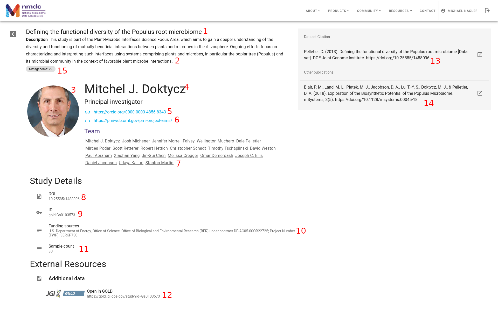
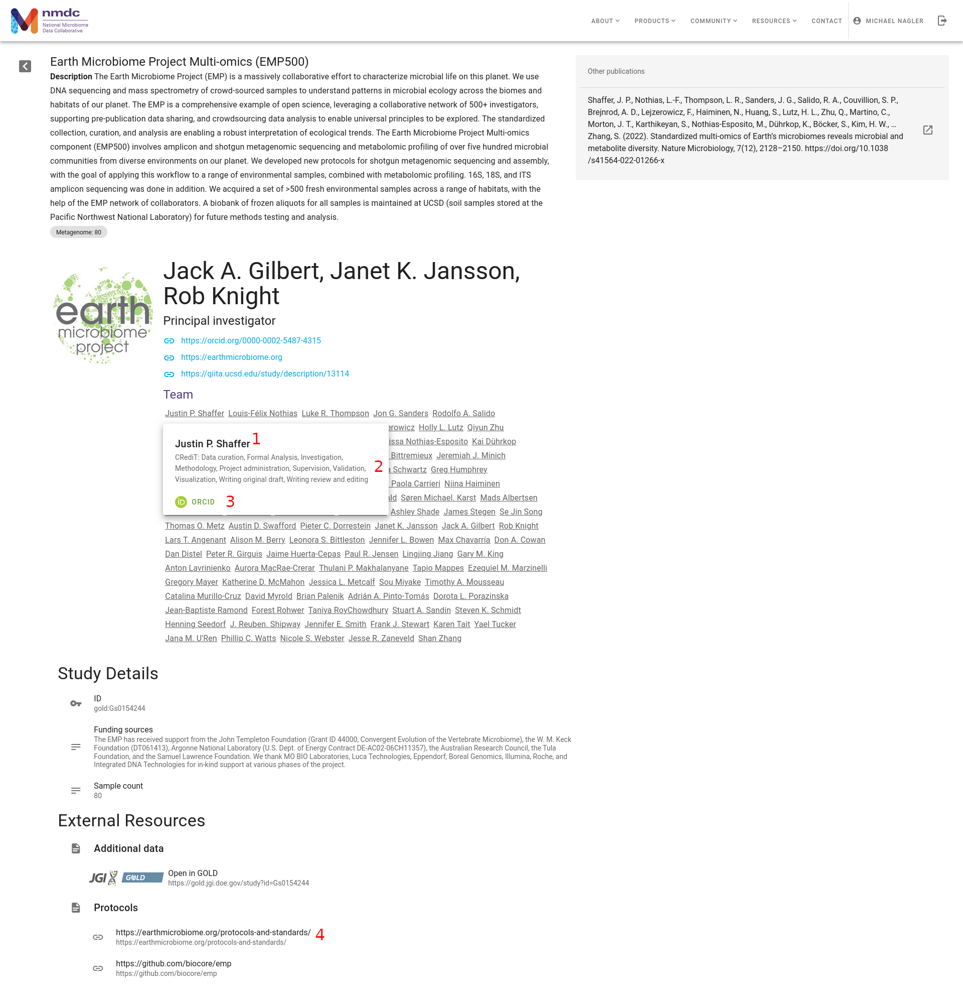
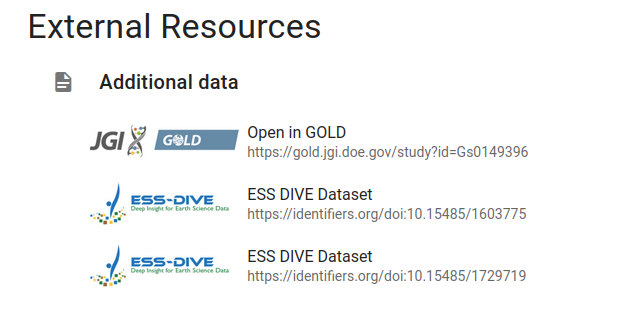
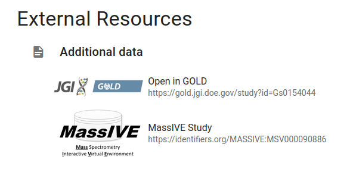

# Study Page

This document describes how the study page is populated in the data portal by describing which slots are used, and how they are interpreted by the data portal. In order to document everything, multiple study pages are used, so if you don't see a slot being used in the first image, it will likely be represented in some other screenshot on the page.

## __Full Study Page__

### __Explanations__

1. This comes directly from the `title` slot of `study` class instances
2. `description` slot of `study` class instances
3.  `profile_image_url` slot of the `principal_investigator` slot (type `PersonValue`) of `study` class instances OR the first entry in the `study_image` slot of `study` class instances. If both are present, priority is given to the `study_image` if both are present. During ingest, the image(s) are downloaded from the specified URI and stored as a `BLOB`s in Postgres. This is for stability reasons. We don't want to risk broken image links.
4. `name` slot of `principal_investigator`
5. `orcid` slot of `principal_investigator`, URL prefix added or expanded by `nmdc-server` in [`web/src/components/InvestigatorBio.vue::getOrcid`](https://github.com/microbiomedata/nmdc-server/blob/main/web/src/components/InvestigatorBio.vue#L5)
6. `websites` slot of `principal_investigator`
7. `name` slot of `applies_to_person` slot of all entries in `has_credit_associations`
8. `has_raw_value` of `doi` slot of `study`. Modified during ingest in [`nmdc_server/ingest/study.py::transform_doi`](https://github.com/microbiomedata/nmdc-server/blob/42f07cbda0d5f44d1b67488b65b0a04c88356261/nmdc_server/ingest/study.py#L42) to only include to DOI, not the full URL.
9. `id` of `study`
10. `funding_sources` of `study`
11. Computed at search time by `nmdc-server`
12. The "Additional data" section is populated by a variety of slots. For the study shown, `nmdc-server` detects that the `id` of this study is prefixed with `"gold:"`. This is [used to compute a URL](https://github.com/microbiomedata/nmdc-server/blob/main/nmdc_server/models.py#L253) at runtime, which is displayed here. Additionally, if the slot `gold_study_identifiers` is populated, those values will be used to compute URLs and displayed here as well.
13. `doi` of `study` (see number 8 for more details). The DOI is passed to a library, [citation-js](https://github.com/citation-js/citation-js), on page load to get the full citation.
14. `publications` slot of `study`. We pass the DOI values in this list to `citation-js` to get the full citation at page load. As with the `doi` slot, we pass strings found in the `publications` slot through `nmdc_server/ingest/study.py::transform_doi`.
15. Computed at search time by `nmdc-server`

## __Full Study Page 2__

### __Explanations__

1-3 above all come from the `has_credit_associations` slot of `study`. During ingest, the value of this slot is stored in a `JSONB` column in the `study` table.  Essentially, we store each `CreditAssociation` value as is, in a list, in this column. During render, we iterate over the `JSONB` column to create each of these names and cards.
1. The `name` of the `PersonValue` stored in the `applies_to_person` slot of the `CreditAssociation`
2. The values stored in the `applied_role` slot of each `CreditAssociation`
3. This button is actually a link to the contributors ORCID page. It appears if the `orcid` slot of the `CreditAssociation`'s `applies_to_person` slot has a value.
4. `relevant_protocols` slot of `study`

## __External Resources: Additional Data__

### __Explanations__

- **ESS Dive Dataset** links are derived from the `ess_dive_datasets` slot of `Study`. The frontend of the data portal prepends `https://identifiers.org/` to each ID it finds in this slot.
- **MassIVE Study** links are derived from the `massive_study_identifiers` slot of `Study`. The frontend of the data portal prepends `https://identifiers.org/` tto each ID it finds in this slot.
